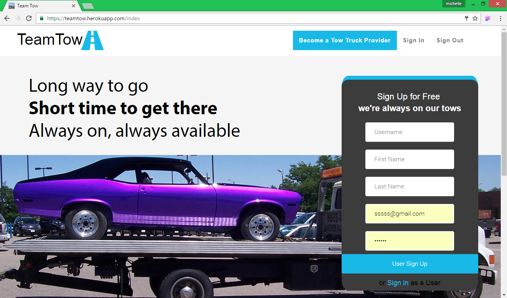

# TEAMTOW
TEAMTOW - using MongoDB, Express.js, React.js, and Node.js( MERN) 

use command 'webpack -w' for updating

### How to install:

- Clone or fork this repo
- Install NodeJS and MongoDB
- Run 'mongod'
- Run `sudo npm install`
- use command 'webpack -w' if you have updated anything in HTML/CSS.
- mongoimport --db teamtow --collection trucks --drop --file ./trucks.json

### How to run: 

- run 'npm start'
- Open a demo client page by going to http://localhost:3000

Powerpoint
https://docs.google.com/presentation/d/1E7ISRB_Uack6Yt_V5CB-aBWs65QBqns1C3ASaw2GSoo/edit#slide=id.gc6f80d1ff_0_27
Video
https://www.youtube.com/watch?v=KS6M5ihxFgg&feature=youtu.be
